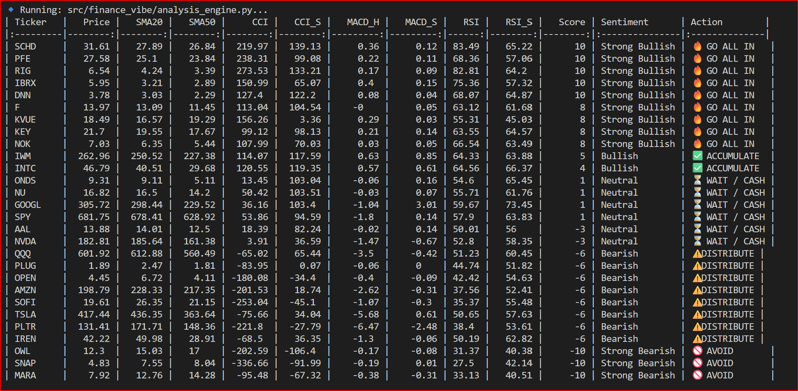
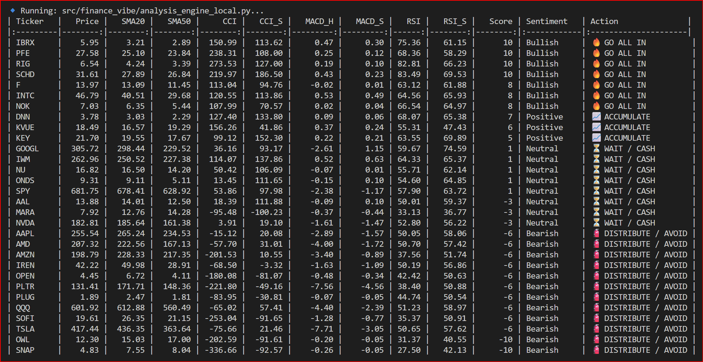

# 📘 Project Handoff: Finance Vibe Pipeline

**Status:** Stable / Production-Ready  
**Date:** 2026-02-20  

---

# 🏗 1. Infrastructure & Environment

The project is containerized to ensure **"Zero-Config" deployment**.

## Core Environment
- VS Code Dev Container (Python 3.12 / Debian-based)

## Persistence
Extensions (Rainbow CSV, Excel Viewer, Pylance) are baked into:
```
.devcontainer/devcontainer.json
```

## Storage Hierarchy
```
data/raw/
```
- Volatile cache for YFinance CSVs (Cleared via maintenance)

```
data/logs/
```
- Immutable archive for dated audit reports


---

# 🚀 2. Standard Operating Procedures (SOP)

## Daily Execution

The pipeline follows a specific orchestration sequence to ensure data integrity.

### Command
```bash
python src/finance_vibe/run_vibe.py
```

### Execution Sequence

1. **ticker_provider.py** — Refreshes the active watch list  
2. **data_ingestor.py** — Fetches 5-year weekly OHLCV data  
3. **analysis_engine.py** — Runs the primary "Vibe" math  
4. **analysis_engine_local.py** — Runs the shadow/local comparison math  

---

## Data Maintenance

To prevent storage bloat or stale data analysis, clear the raw cache weekly:

```bash
rm data/raw/*.csv
```

---

## Validation & Comparison

To audit the results between the two engines (Main vs. Local), run:

```bash
join -t',' -j 1 <(sort data/logs/vibe_report_2026-02-20.csv) <(sort data/logs/vibe_report_local_2026-02-20.csv) | awk -F',' '{print $1 " | Main: " $11 " | Local: " $24}'
```

---

# 📉 3. Technical Logic (The "Vibe" Math)

The Run Team should be aware of the **Robust CCI logic**.

Unlike standard libraries that may "explode" during low volatility, this engine uses a **Manual Mean Absolute Deviation (MAD)** calculation to keep scores within a human-readable $\pm200$ range.

---

# 🛠 4. How to Extend the Project

## Adding New Indicators

1. Open:
   ```
   src/finance_vibe/analysis_engine.py
   ```
2. Add the new calculation in the `calculate_composite_vibe` function  
3. Update the Scoring Matrix (currently a 10-point scale) to accommodate the new weight  

---

## Updating the Ticker Universe

To add permanent tickers (e.g., new ETFs), modify the `STATIC_TICKERS` list in:

```
src/finance_vibe/config.py
```

---

## Automation (Upcoming)

The project is structured for a cron job.

- **Schedule:** Saturday morning at 09:00 (after weekly market close)  
- **Target:** `src/finance_vibe/run_vibe.py`

---

# 🏁 5. Hand-off Checklist

- [x] Data Dir: `data/raw` and `data/logs` exist  
- [x] Config: `config.py` paths point to the internal container structure  
- [x] Git: `.gitignore` is active for `data/raw/*.csv`

## Script output - pandas ta


## Script output - local calculations
