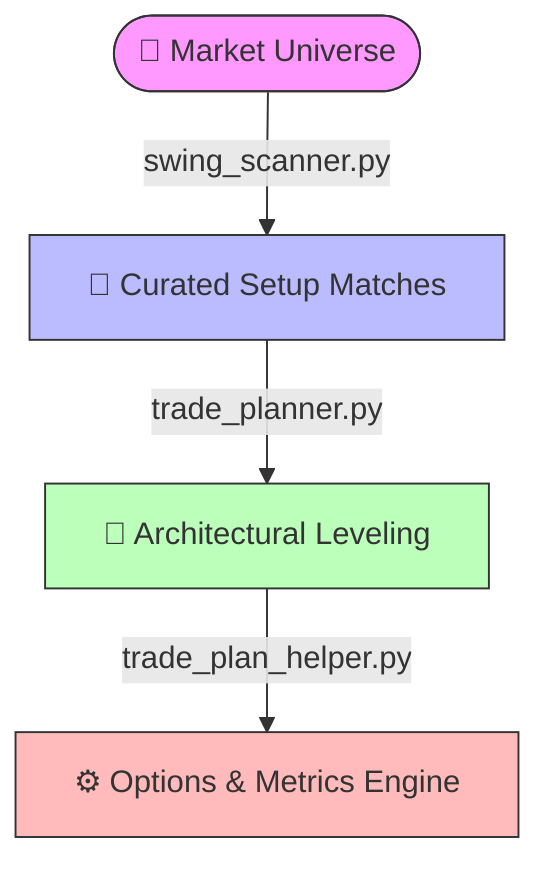

# 🧮 Trade Plan Architecture Documentation

This document outlines the systematic, mathematical pipeline used by the `quant-platform-scanner` ecosystem to transform raw market indicators into actionable, volatility-adjusted trade execution architectures.

---

## 🧭 The Core Workflow Pipeline

The execution architecture operates as a strict multi-step data processing lifecycle:

## 📐 Mathematical Formulas & Logic

The trade planner uses the **Average True Range (ATR)** to dynamically scale risk based on an asset's unique underlying volatility, while anchoring protection to the **50 Exponential Moving Average (EMA50)**.

### 1. Execution Entry Architecture
Instead of chasing the current price, the engine bids slightly below the current close to maximize edge during active pullbacks:
$$\text{Stock Entry} = \text{Close} - (0.25 \times \text{ATR})$$

### 2. Risk Mitigation & Protection (Stop Loss)
The stop loss utilizes structural moving average support cushioned further by a volatility premium padding factor:
$$\text{Stock Stop} = \text{EMA50} - (0.50 \times \text{ATR})$$

### 3. Target Distribution Vectors
Take-profit levels are scaled linearly outwards based on standardized daily volatility expansions:
$$\text{Target 1} = \text{Stock Entry} + (1.00 \times \text{ATR})$$
$$\text{Target 2} = \text{Stock Entry} + (2.00 \times \text{ATR})$$

### 4. Capital Efficiency Metrics
Risk per share and Risk-to-Reward ($R:R$) ratios are computed linearly to evaluate trade viability before capital allocation:
$$\text{Risk Per Share} = \text{Stock Entry} - \text{Stock Stop}$$
$$\text{Risk-to-Reward (R:R)} = \frac{\text{Target Level} - \text{Stock Entry}}{\text{Risk Per Share}}$$

---

## 🔍 Case Study Workbook: HLT (Hilton) Blueprint

To verify or audit internal calculation routines, reference this step-by-step mathematical translation using real scanner outputs.

### Raw Scanner Inputs
* **Close:** `342.89`
* **EMA50:** `332.04`
* **ATR:** `7.46`

### Calculation Output Log
1.  **Stock Entry:** $342.89 - (0.25 \times 7.46) = \mathbf{341.02}$
2.  **Stock Stop:** $332.04 - (0.50 \times 7.46) = \mathbf{328.31}$
3.  **Target 1:** $341.02 + 7.46 = \mathbf{348.48}$
4.  **Target 2:** $341.02 + (2 \times 7.46) = \mathbf{355.94}$
5.  **Risk Per Share:** $341.02 - 328.31 = \mathbf{12.71}$
6.  **Target 1 R:R Ratio:** $\frac{348.48 - 341.02}{12.71} = \mathbf{0.59}$
7.  **Target 2 R:R Ratio:** $\frac{355.94 - 341.02}{12.71} = \mathbf{1.17}$

---

## 🎭 Options Parameter Ruleset (Daily Swing Mode)

When parsing in **DAILY MODE**, the asset holds a multi-week expected duration. The `trade_plan_helper.py` script automatically overlays institutional options criteria based on fixed tracking logic:

| Parameter | Assigned Value / Range | Operational Strategy Logic |
| :--- | :--- | :--- |
| **Options Type** | `CALL` | Assigned strictly for `SETUP_LONG` structures. |
| **Suggested Delta** | `0.65 – 0.80` | Targets deep In-The-Money (ITM) positions to mimic underlying stock replacement closely while mitigating high theta decay. |
| **Expiration Window** | `30 to 90 Days Out` | Matches market parameters dynamically (`Min: Current Month + 1` to `Max: Current Month + 3`). |

---
*Document Version: 1.0.0 | System Date Context: 2026-07-07*

---

## 🛡️ Operational Safeguards & Exception Handling

### 1. Data Validation Gating
Before any asset enters the calculation engine, it must pass a structural completeness gate inside `swing_scanner.py`. 
* **`IGNORE` Classification:** The asset is healthy but does not meet the explicit entry profile (e.g., RSI is too high, or price is not interacting with the EMA20).
* **`insufficient_data` Exception:** Triggered if a ticker lacks sufficient trading history to cleanly establish the backward-looking `EMA50` baseline. Assets failing this check are instantly aborted to prevent mathematical skew in volatile new listings or low-liquidity pairs.

### 2. Asset Suffix Standardization
To maintain compatibility between internal log systems and downstream web services (such as Yahoo Finance asset tracking templates), the symbol tracking architecture mandates clean, un-suffixed global symbols (e.g., `SPY`, `HLT`). Global exchanges or market flags are handled at the UI rendering layer, keeping core data files pristine.

### 3. Dynamic Stop Invalidations
As codified in the `Risk Notes` column output, the `Stock Stop` is directly dependent on structural moving average behavior. If a systemic market shift pushes the moving average line significantly away from the initial calculation print before order execution, the order parameters are considered structurally invalidated and must be manually or programmatically re-calculated.