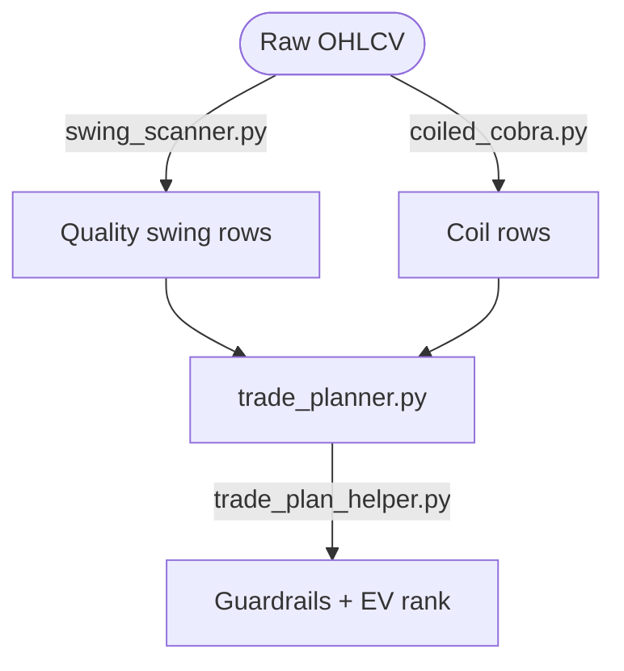

# Trade Plan Architecture

**Code of record:** `config.get_swing_params` / `config.compute_swing_levels` /
`trade_planner.calculate_stock_levels` / `trade_plan_helper.py`.

The planner merges **today's** `swing_setups_<date>.csv` and
`coiled_cobra_setups_<date>.csv` from `config.get_log_dir(mode)` and writes
`trade_plan_<date>.csv`. Row `Mode` is authoritative for swing geometry.

```bash
python src/finance_vibe/trade_planner.py weekly
python src/finance_vibe/trade_planner.py daily
python src/finance_vibe/trade_planner.py high_beta
python src/finance_vibe/trade_plan_helper.py weekly
```

---

## Pipeline



`run_vibe.py` skips Coiled Cobra in `high_beta` mode. `analysis_engine.py` is
not an orchestrator step.

---

## Shared constants

| Key | Value | Where |
| --- | ----- | ----- |
| `entry_atr` | 0.25 | all swing profiles |
| `stop_buffer_atr` | 0.25 | all swing profiles |
| `stop_atr_cap` | 1.5 | all swing profiles |
| `MAX_RISK_PCT_OF_CLOSE` | 0.05 | `config.py` + helper |
| Long delta | 0.65 – 0.80 | `DELTA_LONG` |
| Short delta | −0.80 – −0.65 | `DELTA_SHORT` |

---

## 1. Quality-swing path (`compute_swing_levels`)

### Entry

**Long:** $\text{Entry} = \max(\text{EMA20},\; \text{Close} - 0.25 \times \text{ATR})$

**Short:** $\text{Entry} = \min(\text{EMA20},\; \text{Close} + 0.25 \times \text{ATR})$

### Stop (dual constraint)

Local structure is swing low/high ± `0.25×ATR` (fallback EMA50). The stop is
the tighter of that structure and `entry ± 1.5×ATR`, then capped at **5% of
Close**. A minimum buffer of `0.25×ATR` from entry is always kept.

`high_beta` then **rejects** the row if risk / ATR is outside **[0.5, 1.5]**.

### Targets

| Profile | T1 | T2 |
| ------- | -- | -- |
| `weekly` | Entry ± **1.25×ATR** | Entry ± **2.25×ATR** |
| `daily` | Entry ± **0.85×ATR** | Entry ± **1.6×ATR** |
| `high_beta` | Entry ± **2.0 × risk** | Entry ± **3.0 × risk** |

`use_r_targets` is True only on `high_beta` (`t1_r=2.0`, `t2_r=3.0`).

---

## 2. Coiled Cobra path (`calculate_stock_levels`)

Used when `Source` is `coiled_cobra` / `cobra` **and** `Fib 78.6%` is present.
Fib is **entry context only** — it does not widen the stop.

**Entry:** $\max(\text{Fib }78.6\%,\; \text{Close} - 0.25 \times \text{ATR})$

**Stop (triple constraint, tightest wins):**

- local 10-session swing low − `0.25×ATR` (else `entry − 1.5×ATR`)
- vol floor: `entry − 1.5×ATR`
- price floor: `entry − 5\% \times \text{Close}`
- never tighter than `entry − 0.25×ATR`

**Targets:** T1 = entry + **2.0 × risk**, T2 = entry + **3.0 × risk**.

`_export_levels` re-applies the 5% Close cap after rounding and, when the
geometry was 2R/3R, rebuilds targets from the rounded risk.

---

## 3. Options metadata

| Mode | Contract column | Expiry window | Delta |
| ---- | --------------- | ------------- | ----- |
| `weekly` | `LEAPS Type` | 12–24 months | Long 0.65–0.80 / Short −0.80 to −0.65 |
| `daily`, `high_beta` | `Options Type` | 1–3 months | Same delta bands |

---

## 4. Helper guardrails (`trade_plan_helper.py`)

After direction-aware R:R:

| Gate | Rule |
| ---- | ---- |
| Risk | drop if `Risk Per Share / Close > 0.05` |
| Checklist | drop Coiled Cobra rows with `Checks Met` ratio below `MIN_CHECKS_MET/N_SCORED_PILLARS` (mirrors coiled_cobra's own Gate D breadth threshold, currently `4/6`; swing rows with a blank check pass) |
| T1 R:R | drop if `R:R T1 < 2.0` |

Survivors are ranked:

- `Expected Value = R:R T2 × Score`
- `Priority` = that EV × **1.25** propensity when `Source` is cobra **or** risk ≤ 3% of Close
- Every Coiled Cobra plan has `R:R T1 = 2.0` and `R:R T2 = 3.0` by construction, so `Priority` orders rows exactly by `Score`; the 1.25 propensity is the same for every cobra row and does not affect order. Ties break on Expected Value.
- **ML override (off by default):** only if `config.ML_RANKING_ENABLED` is `True` **and every surviving row has** an `ML_Pred_Return`: `Priority = R:R T2 × max(ML_Pred_Return, 0) × propensity` (ties → Score). Otherwise — flag off, column empty, or incomplete coverage — ranking is by Score, and the helper prints why if predictions were ignored. The flag is off because the v4.0 walk-forward found no out-of-sample edge for ML over Score.

The helper prefers `trade_plan_{today}.csv`, then falls back to the newest
dated `trade_plan_*.csv` in the mode log dir (including `high_beta`).

---

## Worked weekly long (ATR targets)

Inputs: Close 100, EMA20 99, EMA50 95, ATR 4, swing low 96.

1. Entry = max(99, 100 − 1.00) = **99.00**
2. Structure stop = 96 − 1.00 = 95.00; vol floor = 99 − 6.00 = 93.00; price floor = 99 − 5.00 = 94.00 → stop = **95.00**
3. T1 = 99 + 1.25×4 = **104.00**; T2 = 99 + 2.25×4 = **108.00**
4. Risk = 4.00; R:R T1 = 1.25 (this weekly ATR path **fails** the helper's T1 ≥ 2.0 gate)

A `high_beta` or Coiled Cobra 2R/3R path with the same 4.00 risk would print
T1 = 107.00 / T2 = 111.00 and **pass** the helper T1 gate.

---

## Safeguards

- Planner uses **today's** dated scanner files only (no silent reuse of last week's hits).
- `IGNORE` in the scanner means the name is healthy but failed the setup profile.
- `insufficient_data` / `MIN_SAVE_ROWS` (60) abort thin history before EMA50 is reliable.
- If EMA50 or the local swing moves materially before the order is live, levels
  must be recalculated (`Risk Notes` on older weekly plans).
